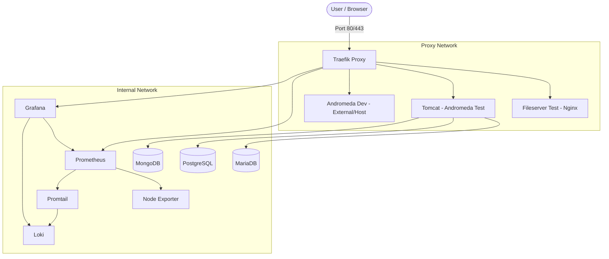

# MilkyWay Home Lab - Test Environment
**Version: 1.0.0**

This repository contains the test environment configuration for the MilkyWay project, based on Docker Compose.

## Table of Contents
1. [Prerequisites](#prerequisites)
2. [Local Domain Configuration (/etc/hosts)](#local-domain-configuration-etchosts)
3. [TLS Certificates](#tls-certificates)
4. [Environment Configuration](#environment-configuration)
5. [Architecture and Containers](#architecture-and-containers)
6. [Starting the Environment](#starting-the-environment)
7. [License and Author](#license-and-author)

## Prerequisites
- Docker and Docker Compose installed.
- `openssl` (optional, for generating self-signed certificates).

## Local Domain Configuration (/etc/hosts)
To access the services using their domain names, add the following entries to your `/etc/hosts` file (on Linux/macOS) or `C:\Windows\System32\drivers\etc\hosts` (on Windows):

```text
127.0.0.1   traefik.test.milkyway
127.0.0.1   prometheus.test.milkyway
127.0.0.1   grafana.test.milkyway
127.0.0.1   resources.test.milkyway
127.0.0.1   andromeda.test.milkyway
127.0.0.1   andromeda.dev.milkyway
```

## TLS Certificates
The environment uses HTTPS. You need to provide TLS certificates for Traefik.

1. Go to the `traefik/certs/` directory.
2. Follow the instructions in [traefik/certs/README.md](traefik/certs/README.md) to generate a self-signed certificate or provide your own.

Quick command to generate a test certificate:
```bash
openssl req -x509 -nodes -days 365 -newkey rsa:2048 \
  -keyout traefik/certs/milkyway.key \
  -out traefik/certs/milkyway.crt \
  -subj "/C=PL/ST=Test/L=Test/O=MilkyWay/CN=*.test.milkyway"
```

## Environment Configuration
Copy the `.env.example` file to `.env` and fill in the required variables (e.g., Traefik dashboard password).

```bash
cp .env.example.example .env.example
```

## Architecture and Containers
Detailed technical specification of containers, networks, and endpoints can be found in [PROJECT_DOCUMENTATION.md](PROJECT_DOCUMENTATION.md).

### Container Diagram


## Starting the Environment
To start all services:
```bash
docker compose up -d
```
The Traefik dashboard will be available at [https://traefik.test.milkyway](https://traefik.test.milkyway).

## License and Author
- **Author**: Szymon Derleta
- **License**: [Apache License 2.0](LICENSE)
