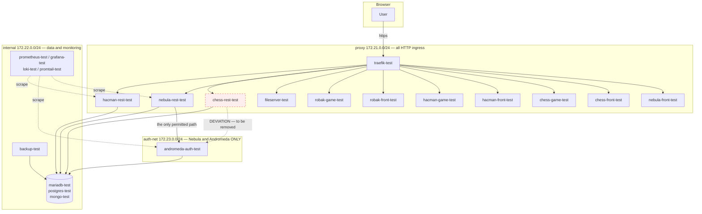

# Architecture — Test Environment

How the containers are named, addressed, and — most importantly — which of them are
allowed to talk to each other.

## The rule that shapes everything

**Andromeda is the authorization server. Only Nebula may talk to it.**

Every other backend authenticates *through Nebula*. No front-end talks to a backend
directly — fronts reach the world through Traefik and nothing else. Backends talk to
backends; fronts talk to fronts. Andromeda is not routable from the outside at all.

This is not a convention that reviewers have to police. It is enforced by **network
membership**: a container that is not on `auth-net` has no route to Andromeda. It cannot
be violated by editing a URL, only by editing `docker-compose.yml` — which is a visible,
reviewable act.

## Networks

| Network | Subnet | `internal:` | Purpose |
|---|---|---|---|
| `proxy` | 172.21.0.0/24 | no | Traefik and everything it routes to. The only network with a path to the outside. |
| `internal` | 172.22.0.0/24 | no | Databases, monitoring, backup. Backends reach their database here. |
| `auth-net` | 172.23.0.0/24 | **yes** | Andromeda and Nebula, nothing else. `internal: true` means no gateway — containers here cannot reach the internet, and the internet cannot reach them. |

> `internal` is a misleading name — it is *not* a Docker `internal: true` network, it just
> carries traffic that has no public route. It is kept for continuity. `auth-net` is the
> one that is genuinely isolated.

## Who is on which network

| Container | proxy | internal | auth-net |
|---|---|---|---|
| `traefik-test` | ✅ | ✅ | — |
| `andromeda-auth-test` | ❌ **no public route** | ✅ (database) | ✅ |
| `nebula-rest-test` | ✅ | ✅ | ✅ **only app permitted** |
| `chess-rest-test` | ✅ | ✅ | ⚠️ *deviation, see below* |
| `hacman-rest-test` | ✅ | ✅ | ❌ |
| `robak-rest-test` (pending) | ✅ | ✅ | ❌ |
| all `*-front-test`, `*-game-test` | ✅ | ❌ | ❌ |
| `mariadb-test`, `postgres-test`, `mongo-test` | ❌ | ✅ | ❌ |
| monitoring, `backup-test` | ❌ | ✅ | ❌ |
| `fileserver-test` | ✅ | ❌ | ❌ |

Two consequences worth stating out loud:

- **Fronts cannot reach the databases.** They are on `proxy` only. This was already true
  in practice; it is now structural.
- **Andromeda has no Traefik router.** It was previously exposed at `/andromeda`. It is
  not any more — there is no reason for a browser to reach the authorization server
  directly, and the route was a standing invitation to bypass Nebula.

## IP allocation

The last octet is stable across networks: `nebula-rest-test` is `.110` on `proxy`,
`.110` on `internal` and `.110` on `auth-net`. One number per container, whichever
network you are looking at.

| Range | Assigned to |
|---|---|
| `.2` | `traefik-test` |
| `.3` – `.19` | infrastructure — prometheus `.3`, grafana `.4`, node-exporter `.5`, loki `.6`, promtail `.7`, fileserver `.8`, backup `.9`, docker-proxy `.10` |
| `.30` – `.39` | databases — mariadb `.31`, postgres `.32`, mongo `.33` |
| `.100` – `.199` | applications, one 10-address block each |

Inside an application block: **rest = base+0, front = base+1, game = base+2**, leaving
seven spare for whatever an app grows.

| App | Block | rest | front | game |
|---|---|---|---|---|
| andromeda | `.100` | `.100` (auth server) | — | — |
| nebula | `.110` | `.110` | `.111` | — |
| chess | `.120` | `.120` | `.121` | `.122` |
| hacman | `.130` | `.130` | `.131` | `.132` |
| robak | `.140` | `.140` *(pending WAR)* | `.141` | `.142` |
| **element** | `.150` | `.150` | `.151` | `.152` |
| **racer** | `.160` | `.160` | `.161` | `.162` |
| **puzzel** | `.170` | `.170` | `.171` | `.172` |
| hub | `.180` | `.180` | `.181` | — *(no game)* |
| element-editor | `.190` | `.190` | `.191` | — *(no game; a separate tool from `element`, not an eighth app-block sibling)* |

Puzzel is reserved, not yet deployed. See `docs/future/ADDING-AN-APP.md`.

## Current deviations

Things that violate the rule above and are known to. Each one is a ticket, not an
accident.

### 1. Chess REST calls Andromeda directly

`chess-rest-test` is on `auth-net`, which it should not be. `ANDROMEDA_AUTH_SERV_URL` in
`env/tomcat/chess-rest.properties` points straight at the authorization server, and
`ALLOWED_APPS_HEADERS` in `andromeda-authorization.properties` still lists
`chess_rest_api`.

It is left in place deliberately: removing the network membership without changing the
application first would break Chess login on the next container recreate. The exception
is one `auth-net:` block in `docker-compose.yml` — deleting it is the whole fix, once:

1. Chess REST validates its tokens through Nebula instead of Andromeda,
2. `chess_rest_api` is dropped from `ALLOWED_APPS_HEADERS`,
3. `chess-rest-test` is recreated and login is verified.

`robak_rest_api`, `element_rest_api` and `racer_rest_api` are also still listed in
`ALLOWED_APPS_HEADERS`. None of those containers exists yet — remove the headers when
each app is built, so that the list never grants more than it must.

### 2. Front-end credentials ship to the browser

`env/nginx/chess/.env` and `env/nginx/robak-*/.env` carry `REACT_APP_PASSWORD` /
`VITE_PASSWORD`. Vite and CRA bake these into the bundle at build time, so they are
readable by anyone who opens the page — `git` is not what exposes them. Rotating them
raises the bar slightly; the real fix is a server-side auth flow. Recorded here so that
nobody mistakes them for secrets that gitignore protects.

### 3. Transitional network aliases

Every renamed container still answers to its old DNS name via a `aliases:` entry in
`docker-compose.yml`. This exists so that the rename could happen without a flag-day
edit of `dynamic.yml`, the properties files and `prometheus.yml`. Once those all use the
new names and the stack has been recreated, delete the `aliases:` blocks — see
`docs/MIGRATION.md`.

## Request path, end to end

A user opening the Chess app:

1. Browser → `https://milkyway.test/chess/app/` → **traefik-test** (`proxy`, `.2`).
2. Traefik matches the `chess-front-test` router → **chess-front-test** (`proxy`, `.121`),
   a plain nginx serving the built bundle.
3. The bundle calls `https://milkyway.test/chess/api/v1/...` — back out to the browser,
   back in through Traefik, `strip-chess` middleware → **chess-rest-test** (`.120`).
4. chess-rest-test reads and writes `test_chess` on **mariadb-test** (`internal`, `.31`).
5. For authentication it *should* call **nebula-rest-test** (`.110`), which is the only
   container allowed to call **andromeda-auth-test** (`auth-net`, `.100`). Today it calls
   Andromeda itself — deviation #1.

Note step 3: the front-end never talks to the backend over the docker network. It cannot —
they share only `proxy`, and the browser is the one making the call. Traefik is the single
front door.
