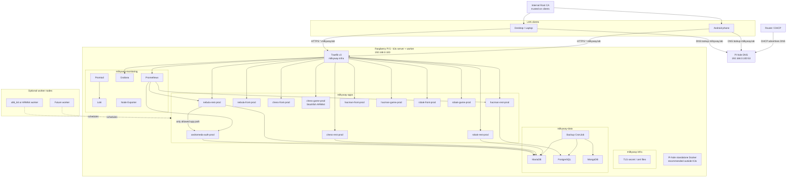

# Production Architecture

This document defines the target production architecture for MilkyWay HomeLab on **K3s** using the domain **`milkyway.lab`**.

## Design principles

1. Keep the current **single-domain, path-based Traefik routing** model.
2. Keep the current **application naming convention**, replacing `-test` with `-prod`.
3. Replace Docker network membership with **Kubernetes NetworkPolicy**.
4. Keep **Andromeda private** and reachable only from **Nebula REST**.
5. Make the first node a **Raspberry Pi 5 ARM64** but keep the cluster ready for more worker nodes.

## Full architecture diagram



## Namespace design

| Namespace | Contents | Notes |
|---|---|---|
| `milkyway-infra` | Traefik, Pi-hole if ever containerized in K8s, TLS secrets, cert helpers | Core ingress and cluster-level helpers |
| `milkyway-apps` | Andromeda, Nebula, Chess, Hacman, Robak | Main application workloads |
| `milkyway-data` | MariaDB, PostgreSQL, MongoDB, backup CronJobs, PVCs | Stateful services with persistent storage |
| `milkyway-monitoring` | Prometheus, Grafana, Loki, Promtail, Node Exporter | Observability stack |

Recommended namespace labels:

```yaml
apiVersion: v1
kind: Namespace
metadata:
  name: milkyway-apps
  labels:
    name: milkyway-apps
    milkyway.io/tier: apps
```

Use the `name` label consistently because NetworkPolicies often select source namespaces by label.

## Production route map

The current `traefik/config/dynamic.yml` routes translate 1:1 to Traefik CRDs in K3s.

| Path on `https://milkyway.lab` | Target |
|---|---|
| `/dashboard` | Traefik dashboard |
| `/prometheus/` | Prometheus |
| `/grafana/` | Grafana |
| `/resources/` | Fileserver or static resources service |
| `/nebula/api` | `nebula-rest-prod` |
| `/nebula/app/` | `nebula-front-prod` |
| `/chess/api` | `chess-rest-prod` |
| `/chess/app/` | `chess-front-prod` |
| `/chess/game/` | `chess-game-prod` |
| `/hacman/api` | `hacman-rest-prod` |
| `/hacman/app/` | `hacman-front-prod` |
| `/hacman/game/` | `hacman-game-prod` |
| `/robak/api` | `robak-rest-prod` |
| `/robak/app/` | `robak-front-prod` |
| `/robak/game/` | `robak-game-prod` |
| `/andromeda` | **No route in production** |

## Network policies replacing Docker networks

Kubernetes does not provide fixed named bridge networks like Docker Compose. The replacement is a combination of:

- **Namespaces** for broad separation
- **Services** for stable discovery
- **NetworkPolicies** for who may talk to whom

| Test network | Production equivalent | Practical meaning |
|---|---|---|
| `proxy` | Traefik in `milkyway-infra` + `allow-from-traefik` ingress policy | Only workloads explicitly opened to Traefik receive ingress |
| `internal` | `milkyway-data` / `milkyway-monitoring` namespaces + `allow-internal` egress/ingress policies | Backends can reach databases and monitoring only where allowed |
| `auth-net` | `allow-auth-net` NetworkPolicy between `nebula-rest-prod` and `andromeda-auth-prod` | Only Nebula may reach Andromeda |

Recommended policy pattern:

1. Apply **default deny** to `milkyway-apps`, `milkyway-data`, and `milkyway-monitoring`.
2. Add **targeted allow** policies for Traefik ingress, DB access, metrics scraping, and Nebula → Andromeda.
3. Do **not** create a public Service or IngressRoute for Andromeda.

## Service naming and DNS in production

Keep the same naming rule as test, but use the `-prod` suffix:

```text
<app>-<role>-prod
```

Examples:

- `andromeda-auth-prod`
- `nebula-rest-prod`
- `nebula-front-prod`
- `chess-rest-prod`
- `chess-front-prod`
- `chess-game-prod`

In Kubernetes, the stable identity is the **Service DNS name**, not the pod IP. Examples:

| Purpose | Stable name |
|---|---|
| Nebula REST service | `nebula-rest-prod.milkyway-apps.svc.cluster.local` |
| Andromeda service | `andromeda-auth-prod.milkyway-apps.svc.cluster.local` |
| MariaDB service | `mariadb-prod.milkyway-data.svc.cluster.local` |
| Grafana service | `grafana-prod.milkyway-monitoring.svc.cluster.local` |

### IP allocation in production

Static per-container IPs from the test environment should **not** be carried into Kubernetes. Use this model instead:

| Layer | Static or dynamic | Recommendation |
|---|---|---|
| Router DHCP reservation for the first node | Static | Example `192.168.0.100` |
| Pi-hole DNS IP | Static | Same IP as the first node if Pi-hole runs there |
| MetalLB ingress VIPs | Static range | Example `192.168.0.110-192.168.0.119` |
| Pod IPs | Dynamic | Ignore; pods are cattle, not pets |
| ClusterIP service IPs | Dynamic but stable within the cluster | Use names, not numbers |

## Pi-hole, Traefik, and TLS flow

1. A client asks Pi-hole for `milkyway.lab` or `*.milkyway.lab`.
2. Pi-hole answers with the Raspberry Pi ingress IP (or a MetalLB VIP).
3. The client connects to Traefik on `:443`.
4. Traefik serves the wildcard certificate signed by the internal CA.
5. Traefik matches the path and forwards to the matching Service in `milkyway-apps`, `milkyway-monitoring`, or `milkyway-infra`.
6. NetworkPolicies allow only the intended backend path.

## Security-critical rules

- **Andromeda has no public route.**
- **Only Nebula REST may call Andromeda.**
- **Frontends talk to users through Traefik, not directly to databases.**
- **Chess must stop using the direct Andromeda path** that still exists in the test environment.
- **All secrets move into Kubernetes Secrets, Ansible Vault, or GitHub Secrets.**

## Test vs production comparison

| Area | Test (`docker-compose`) | Production (`k3s`) |
|---|---|---|
| Domain | `milkyway.test` | `milkyway.lab` |
| Ingress config | Traefik file provider (`dynamic.yml`) | Traefik CRDs (`IngressRoute`, `Middleware`) |
| Networking | Docker bridge networks with static IPs | Namespaces + Services + NetworkPolicies |
| Auth isolation | `auth-net` bridge membership | `allow-auth-net` policy |
| Scheduling | Single Docker host | K3s scheduler across server and worker nodes |
| Service identity | Container name + static IP | Kubernetes Service DNS |
| Storage | Docker named volumes | PVCs on `local-path`, NFS, or Longhorn |
| Secrets | `.env`, bind mounts | Kubernetes Secrets, Ansible Vault, GitHub Secrets |
| Certificates | Files mounted into Traefik | K8s TLS Secret or file provider from `/mnt/nvme/k3s/traefik/certs/` |
| Deployments | `docker compose up -d` | `terraform apply`, `kubectl apply`, or GitHub Actions rollout |
| Multi-node | No | Yes |
| ARM64 support | Optional | Mandatory on the Raspberry Pi node |

## Recommended production defaults

- First node: **Raspberry Pi 5** acting as **K3s server + worker**.
- Additional nodes: workers only.
- Storage: start with **local-path** on NVMe; move databases to NFS or Longhorn only when you outgrow single-node storage.
- Ingress: **Traefik v3 via Helm**.
- DNS: **Pi-hole outside K3s**.
- External IPs: **Router reservation** plus **MetalLB** if you want a virtual ingress IP instead of node IP routing.
