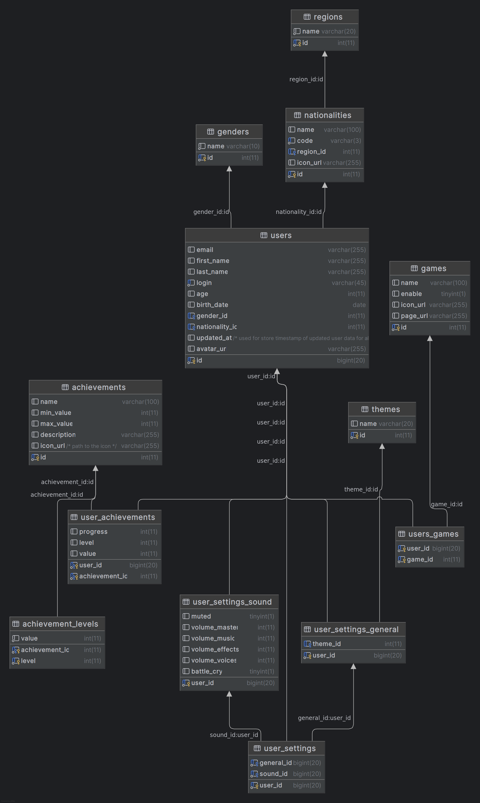

# Nebula Schema

<div align="left">


  


</div>


### Structure

```filetree
model/ – Includes the latest full database schema exported from DataGrip. A preview of the current model is shown below.
tables/ – Contains individual SQL files generated for each database table.
test_data/ – Stores sql files with insert queries used in test_andromeda database.
archive/ – Stores legacy and archived materials for reference.
```

### Current Model Preview



*Nebula Schema - 2026-02-05*
